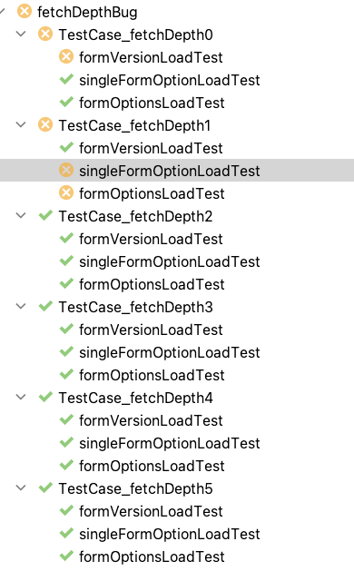

# Hibernate 6 Upgrade Issue with `max_fetch_depth` Parameter

_Note that this has been logged on the Hibernate ORM issue tracker: https://hibernate.atlassian.net/browse/HHH-16871_

## Outline
We have recently upgraded to Hibernate 6.2.5.Final. After updating, we noted an issue related to the `max_fetch_depth` parameter:

Depending on the value of `max_fetch_depth`, entity relationships defined on fetched entities as @ManyToOne and
@OneToMany were being set to **null** rather than initialised with a proxy. This appears to be a bug to us because there is no way 
to now distinguish between absent data and data that should be lazily loaded. This is demonstrated by the results of the following test cases:

   1. TestCase_FetchDepth0.formInputsLoadTest
   2. TestCase_FetchDepth0.formVersionLoadTest
   3. TestCase_FetchDepth1.formInputsLoadTest
   4. TestCase_FetchDepth2.formInputsLoadTest
   5. TestCase_FetchDepth2.formVersionLoadTest
   6. TestCase_FetchDepth3.formInputsLoadTest
   
   .. in all of these test cases, the formVersion fields or the formInputs fields on their respective entities should at least be
   lazily fetched, but never null.

## Entity Model
Our highly simplified Entity Model consists of the following:

    ┌───────┐      ┌────┐
    │Program│1────*│Step│1──┐
    └───────┘      └────┘   │
                            │1
               ┌────────────┴─────┐       ┌───────────┐
               │Step Configuration│1─────*│ FormOption│
               └──────────────────┘       └───────────┘
                                                1
                                                │
                                                │
                                                1
                                          ┌───────────┐       ┌────┐
                                          │FormVersion│*─────1│Form│
                                          └───────────┘       └────┘
                                                1
                                                │
                                                │
                                                *
                                           ┌─────────┐
                                           │FormInput│
                                           └─────────┘
    
Note that FormVersion entities have a composite primary key consisting of the Form ID and a version number.

## Test Cases
We created an abstract superclass which is subclassed six times in order to test different values for the `max_fetch_depth` parameter, `AbstractTestCase`.
The superclass populates sample data per the entity model above, commits the transaction and clears the entityManager. It then fetches the Step entity
twice via its ID, and performs two tests:
1. formVersionLoadTest, in which it checks that the `formVersion` field on the first FormOption returned is non-null (step.configuration.formOptions[0].formVersion).
2. formInputsLoadTest, in which it checks that the `inputs` field on the FormVersion entity is not null (step.configuration.formOptions[0].formVersion.inputs).

## Sample Test Results


## Running Locally
``mvn test`` should do it.

By default, it can be a little slow due to the debug messages in the log. To speed it up, tweak the logging config in `src/main/resources/logback.xml`:
```
    <root level="info"> <!-- changed from 'debug' -->
        <appender-ref ref="STDOUT" />
    </root>
```
